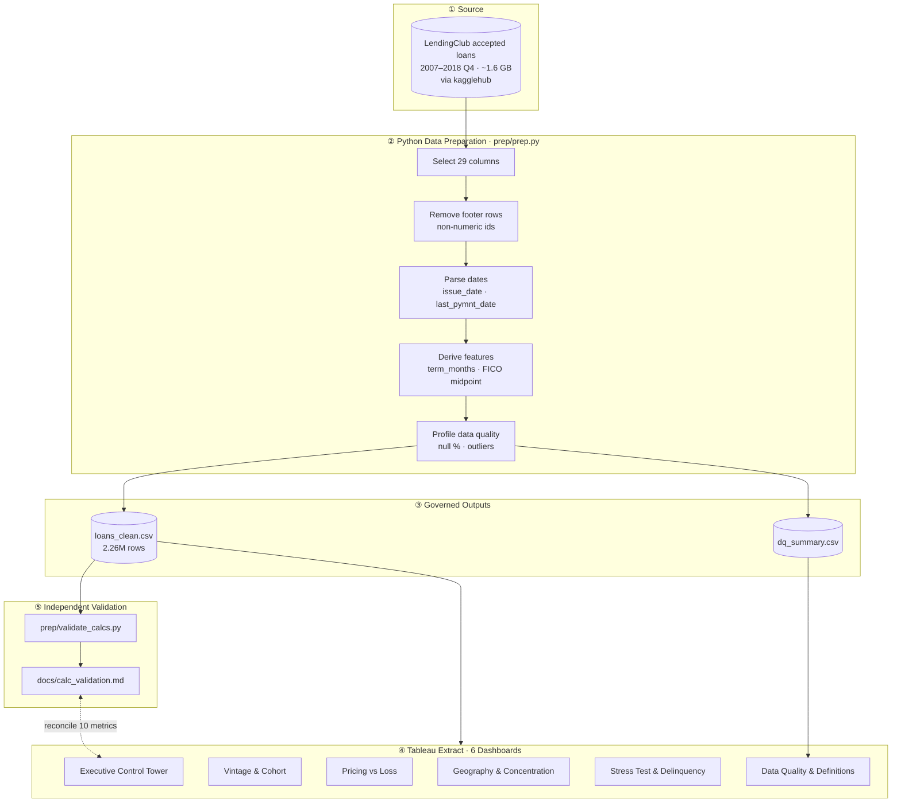
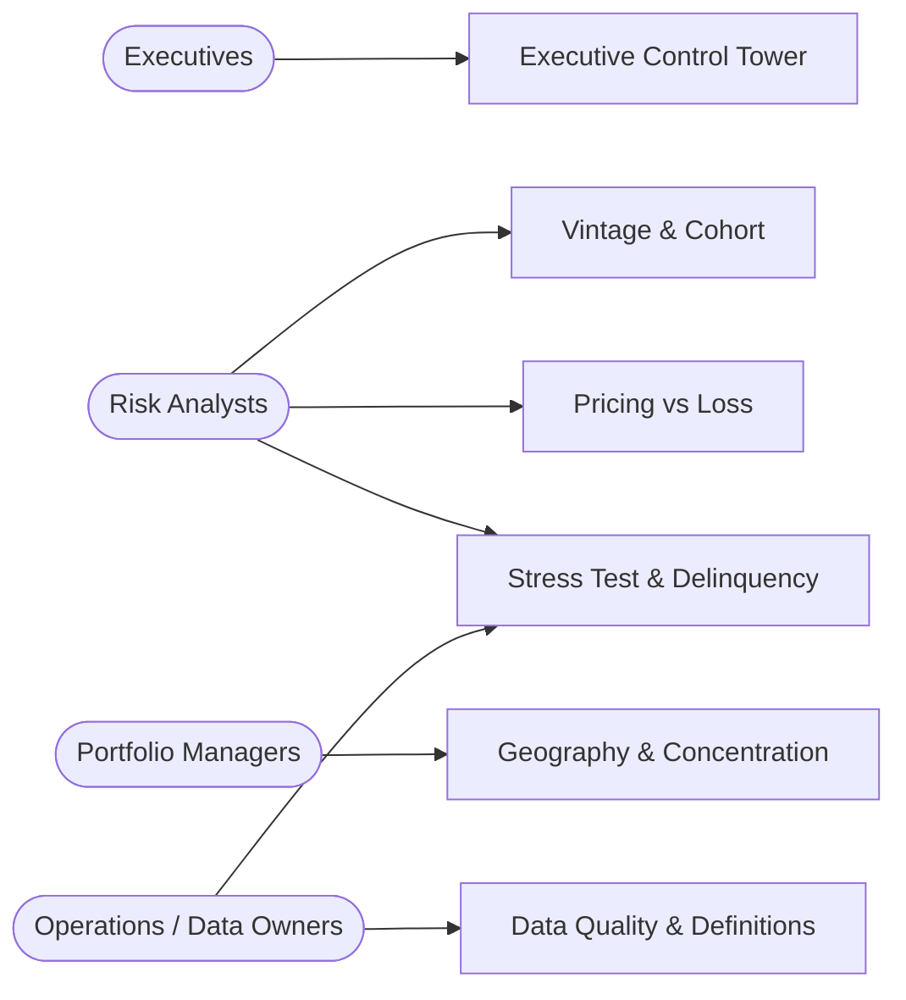
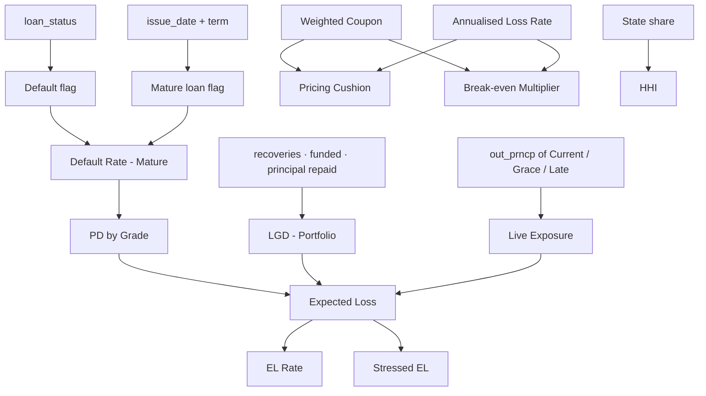
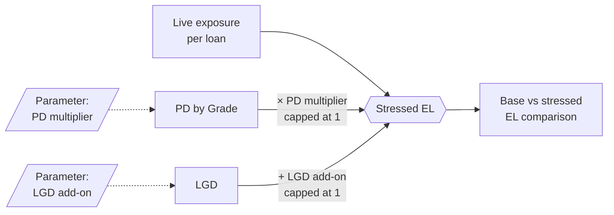
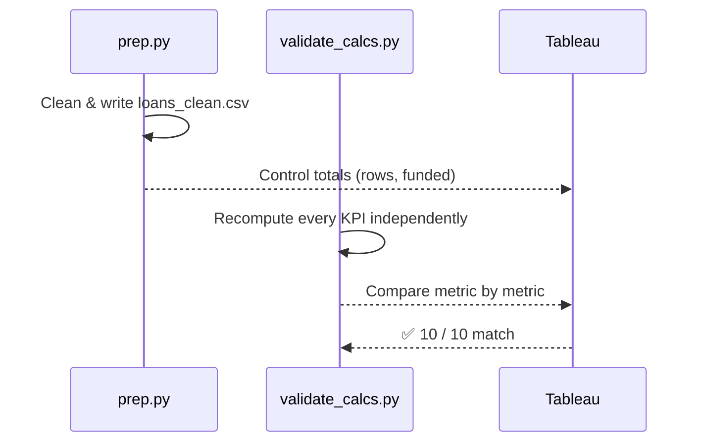

<div align="center">

# 📊 Credit Portfolio Risk & Operations Control Tower

**A governed, six-dashboard Tableau suite that turns 2.26 million raw loan records into one trusted set of credit risk and operations metrics.**


### [▶ Open the Live Dashboard on Tableau Public](https://public.tableau.com/views/CreditPortfolioRiskOperationsControlTower/ExecutiveControlTower?:language=en-US&publish=yes&:sid=&:redirect=auth&:display_count=n&:origin=viz_share_link)

**2,260,668** loans · **$34.0B** funded · **6** dashboards · **14** governed KPIs · **10/10** metrics reconciled

</div>

---

## 📑 Table of Contents
1. [Executive Summary](#1-executive-summary)
2. [Business Problem](#2-business-problem)
3. [Key Results](#3-key-results)
4. [Solution Architecture](#4-solution-architecture)
5. [Data Preparation & Quality](#5-data-preparation--quality)
6. [Metric Framework](#6-metric-framework)
7. [Dashboard Suite](#7-dashboard-suite)
8. [Stress Testing Logic](#8-stress-testing-logic)
9. [Validation & Reconciliation](#9-validation--reconciliation)
10. [Key Findings](#10-key-findings)
11. [Tech Stack](#11-tech-stack)
12. [How to Reproduce](#12-how-to-reproduce)
13. [Repository Structure](#13-repository-structure)
14. [Limitations](#14-limitations)
15. [Roadmap](#15-roadmap)

---

## 1. Executive Summary
This project builds a **credit risk control tower** on the public LendingClub accepted-loans file (2007 – 2018 Q4):
- A Python pipeline cleans and profiles the raw loan tape.
- One **governed metric dictionary** defines every KPI exactly once.
- Six Tableau dashboards serve **executives, risk analysts and operations teams**: expected loss, vintage performance, pricing adequacy, concentration, stress testing, delinquency and data quality.
- Every headline number is **independently recomputed in Python and reconciled against Tableau**.

## 2. Business Problem

| Pain point | Consequence | How the control tower solves it |
| :--- | :--- | :--- |
| Static monthly reports | Deteriorating vintages are spotted late | Interactive vintage × grade heatmap |
| Teams define "default rate" differently | Conflicting numbers in leadership meetings | **One definition per KPI**, documented in a metric dictionary |
| No view of pricing adequacy | Grades may be under-priced for their losses | Coupon vs annualised loss and pricing cushion by grade |
| Unknown concentration risk | Hidden geographic exposure | State map, Pareto, HHI and top-5 share |
| No stress view | Can't size losses in a downturn | Parameter-driven PD and LGD stress test |
| Untrusted data | Low confidence in every chart | Data quality dashboard and Python ↔ Tableau reconciliation |

## 3. Key Results

| Metric | Value |
| :--- | ---: |
| 📦 Loans analysed | **2,260,668** |
| 💰 Total funded | **$34.0B** |
| ⚠️ Default Rate (mature loans) | **14.86%** |
| 📶 PD Grade A → Grade G | **5.50% → 37.35%** |
| 🔻 LGD (portfolio) | **89.18%** |
| 🏦 Live exposure | **$9.51B** |
| 📉 Expected Loss (lifetime, live book) | **$1.29B** (13.6% of live exposure) |
| 🌪️ Stressed EL (PD ×1.5, LGD +5 pp) | **$2.05B (+58.4%)** |
| 🛡️ Gross pricing cushion | **+10.09%** (break-even at **5.13×** current loss) |
| ⏰ Delinquent share of live book | **4.04%** |
| 🗺️ Funded HHI | **527.6** (low concentration) |
| ✅ Python ↔ Tableau reconciliation | **10 / 10 metrics match** |

---

## 4. Solution Architecture



### Who uses what



## 5. Data Preparation & Quality

| Step | Detail |
| :--- | :--- |
| Ingestion | `kagglehub` downloads `accepted_2007_to_2018Q4.csv` |
| Column selection | 29 columns kept for risk, pricing, geography and performance |
| Cleansing | Footer and summary rows removed (non-numeric `id`) |
| Parsing | `issue_d`, `last_pymnt_d` converted from `%b-%Y` to dates |
| Feature engineering | `term_months` extracted from text, `fico` = midpoint of FICO range |
| Data quality profile | Null % per field, outlier counts (e.g. `dti` < 0 or > 60, `annual_inc` ≤ 0) → `dq_summary.csv` |
| Control totals | Row count and total funded amount printed. **Both must match the Tableau extract.** |

## 6. Metric Framework

Every KPI has **exactly one definition**, documented in [`docs/metric_dictionary.md`](docs/metric_dictionary.md).



| KPI | Definition |
| :--- | :--- |
| **Default** | `loan_status` is Charged Off, Default, or "Does not meet the credit policy" |
| **Mature loan** | Issue date + term ≤ 31 Dec 2018 (depends only on issue date and term, **never on outcome**) |
| **Default Rate (Mature)** | Defaulted loans / loans, mature loans only |
| **PD by Grade** | Default Rate (Mature) at grade level |
| **LGD (Portfolio)** | 1 − recoveries / (funded − principal repaid), all defaulted loans |
| **Live exposure** | Outstanding principal of Current, In Grace Period and Late loans |
| **Expected Loss** | Σ live exposure × PD by Grade × LGD (lifetime, on remaining balance) |
| **EL Rate** | Expected Loss / live exposure (lifetime, not annual) |
| **Weighted Coupon** | Funded-weighted interest rate, mature loans |
| **Annualised Loss Rate** | Net loss on mature defaults / Σ(funded × term in years) |
| **Pricing Cushion** | Weighted Coupon − Annualised Loss Rate (gross) |
| **Break-even Multiplier** | Weighted Coupon / Annualised Loss Rate |
| **Stressed EL** | Σ live exposure × min(1, PD × multiplier) × min(1, LGD + add-on) |
| **HHI** | Σ (state share)² × 10,000 |

> **Why "mature loans" matters:** including loans that haven't reached term would understate default rates, because those loans haven't had time to default. Maturity is defined independently of outcome to avoid survivorship bias.

## 7. Dashboard Suite

| # | Dashboard | Key visuals | Business question |
| :---: | :--- | :--- | :--- |
| 1 | **Executive Control Tower** | KPI strip, quarterly issuance vs 36-month default rate, View By toggle (Grade / Purpose / State) | *How big is the book and how is it performing?* |
| 2 | **Vintage & Cohort** | Vintage × grade heatmap (36-month loans), moving average, default rate by term | *Which cohorts are deteriorating?* |
| 3 | **Pricing vs Loss** | Coupon vs annualised loss by grade, pricing cushion, FICO × DTI matrix, coupon vs default scatter | *Are we paid enough for the risk?* |
| 4 | **Geography & Concentration** | State map, Pareto, HHI and top-5 share, funded / live basis toggle | *Where is exposure concentrated?* |
| 5 | **Stress Test & Delinquency Watchlist** | PD multiplier and LGD add-on parameters, stressed EL, delinquency heatmap, top-20 state × sub-grade watchlist | *What happens in a downturn, and what needs attention now?* |
| 6 | **Data Quality & Definitions** | Null % by field, outlier counts, metric dictionary, live reconciliation | *Can we trust these numbers?* |

Build steps for every sheet, calculated field and parameter: [`docs/tableau_build_guide.md`](docs/tableau_build_guide.md)

## 8. Stress Testing Logic



| Scenario | Expected Loss | Change |
| :--- | ---: | ---: |
| Base | $1.29B | — |
| PD ×1.5, LGD +5 pp | $2.05B | **+58.4%** |

## 9. Validation & Reconciliation



| Metric | Python | Tableau | Match |
| :--- | :--- | :--- | :---: |
| Row count | 2,260,668 | 2,260,668 | ✅ |
| Total funded | $34.0B | $34.0B | ✅ |
| Default Rate (Mature) | 14.86% | 14.86% | ✅ |
| PD Grade A / Grade G | 5.50% / 37.35% | 5.50% / 37.35% | ✅ |
| LGD (Portfolio) | 89.18% | 89.18% | ✅ |
| Expected Loss | $1.3B | $1.3B | ✅ |
| Weighted Coupon (mature) | 12.53% | 12.53% | ✅ |
| Annualised Loss Rate | 2.44% | 2.44% | ✅ |
| Pricing Cushion | 10.09% | 10.09% | ✅ |
| HHI (funded / live) | 527.6 / 507.1 | 527.6 / 507.1 | ✅ |

Full output: [`docs/calc_validation.md`](docs/calc_validation.md)

## 10. Key Findings

**1. Pricing covers loss in every grade.**

| Grade | Mature loans | Default rate | Coupon | Annualised loss | Cushion |
| :---: | ---: | ---: | ---: | ---: | ---: |
| A | 144,228 | 5.50% | 7.23% | 0.78% | +6.46% |
| B | 220,255 | 11.37% | 10.89% | 1.73% | +9.16% |
| C | 180,248 | 18.30% | 14.19% | 2.90% | +11.29% |
| D | 87,158 | 23.83% | 17.39% | 4.09% | +13.31% |
| E | 32,154 | 29.40% | 20.32% | 4.65% | +15.67% |
| F | 10,352 | 34.51% | 23.25% | 5.06% | +18.19% |
| G | 2,064 | 37.35% | 24.44% | 5.29% | +19.15% |

The portfolio cushion is **+10.09%**. Annualised loss would need to rise about **5.13×** before the cushion reaches zero.

**2. Vintages have stabilised.** Among 36-month loans, the 2007 vintage defaulted at **26.20%**, but it is a tiny cohort (603 loans). Large cohorts from 2012 to 2015 (43K – 283K loans each) sit in a **12.3% – 14.9%** band.

**3. The thinnest margins are in prime credit, not subprime.** Among FICO × DTI cells with at least 1,000 mature loans, the lowest cushion is **740+ FICO / 10–19% DTI (+7.47%)**. Low coupons leave less room for error, even though defaults there are only about 6%.

**4. Concentration is low.** The top-5 states (CA 14.1%, TX 8.6%, NY 8.1%, FL 6.9%, IL 4.2%) hold **41.9%** of funded volume and **41.3%** of live exposure. HHI is **527.6** (funded) and **507.1** (live).

**5. Stress adds more than half again to expected loss.** Delinquent loans are **4.04%** of the live book. At PD ×1.5 and LGD +5 pp, expected loss rises from **$1.29B to $2.05B (+58.4%)**.

## 11. Tech Stack

| Layer | Tools |
| :--- | :--- |
| Data acquisition | Python, kagglehub |
| Cleansing & feature engineering | pandas, NumPy |
| Validation | Python (independent KPI recomputation) |
| Visualisation & BI | Tableau Desktop / Tableau Public: calculated fields, LOD expressions, parameters, dashboard actions |
| Documentation | Metric dictionary, build guide, validation report |

## 12. How to Reproduce

```bash
# 1. Install dependencies
pip install -r requirements.txt

# 2. Download, clean and profile the data
python prep/prep.py                                  # → data/loans_clean.csv, data/dq_summary.csv

# 3. Independently compute every KPI
python prep/validate_calcs.py                        # → docs/calc_validation.md

# 4. Print the numbers quoted in this README
python prep/readme_numbers.py data/loans_clean.csv
```

Then connect Tableau to both CSVs **as extracts** and rebuild by following [`docs/tableau_build_guide.md`](docs/tableau_build_guide.md).

## 13. Repository Structure

```
├── prep/
│   ├── prep.py               # download, clean, engineer features, DQ profile
│   ├── validate_calcs.py     # independent KPI recomputation
│   └── readme_numbers.py     # numbers quoted in this README
├── docs/
│   ├── metric_dictionary.md  # one definition per KPI
│   ├── tableau_build_guide.md# step-by-step dashboard build
│   └── calc_validation.md    # Python validation output
├── data/                     # generated CSVs (git-ignored)
└── requirements.txt
```


<div align="center">

**Aryan Nimbalkar** · [LinkedIn](https://linkedin.com/in/aryan-nimbalkar-65b951344) · [GitHub](https://github.com/aryanimbalkar03-lab)

</div>

