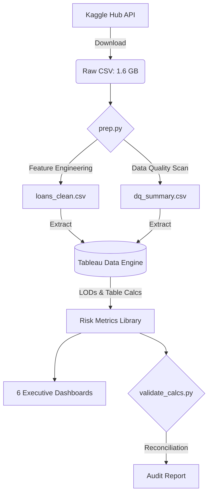

# Credit Portfolio Risk & Operations Control Tower (Tableau)


**One-line pitch:** A 6-dashboard Tableau suite on ~2.26M LendingClub loans that turns a raw loan tape into a governed risk-and-operations cockpit: LOD-driven PD/LGD/expected-loss, vintage cohorts, pricing adequacy, concentration (HHI), parameter-driven stress testing, delinquency watchlist and a data-quality/definitions layer.

---

## Architecture & Workflow


## Table of Contents
1. [Problem Statement](#1-problem-statement)
2. [Tools & Stack](#2-tools--stack)
3. [Data Pipeline](#3-data-pipeline)
4. [Data Model (Tableau)](#4-data-model-tableau)
5. [Metric Definitions & Calculation Library](#5-metric-definitions--calculation-library)
6. [Dashboard Tour (6 Dashboards)](#6-dashboard-tour-6-dashboards)
7. [Advanced Tableau Features Used](#7-advanced-tableau-features-used)
8. [Calculation Validation](#8-calculation-validation)
9. [Key Findings (Data-Driven)](#9-key-findings-data-driven)
10. [Limitations](#10-limitations)
11. [Project Structure](#11-project-structure)
12. [How to Reproduce](#12-how-to-reproduce)

---

## 1. Problem Statement

Loan operations and risk teams receive static monthly reports. They can't see which vintages are deteriorating, whether pricing covers realised loss, how concentrated the book is, how much expected loss moves under stress, or how trustworthy the underlying data is. Each team also defines 'default rate' differently.

**Objective:** One governed data model with one metric definition per KPI, feeding self-serve dashboards for three audiences: executive (summary), risk analyst (vintage, pricing, concentration, stress), operations (delinquency watchlist, data quality).

---

## 2. Tools & Stack

| Tool | Use | Cost |
|------|-----|------|
| **Tableau Public Desktop** | Build and publish (extract-only, 15M row limit; fine for 2.26M) | Free |
| **Python 3.11 + pandas** | Trim and type the CSV, produce the DQ summary, validate calcs | Free |
| **Kaggle (kagglehub)** | Dataset: LendingClub 'accepted_2007_to_2018Q4.csv' (public) | Free |

*Machine recommendation:* 16 GB RAM recommended; the raw CSV is ~1.6 GB.

---

## 3. Data Pipeline

The `prep.py` script manages the data ingestion and preparation:
- **Downloads** the dataset from Kaggle via `kagglehub`.
- **Selects** 29 relevant columns.
- **Cleans** footer rows and parses dates.
- **Engineers** features (e.g., FICO midpoint, `term_months`).
- **Generates** a data quality summary CSV.

**Reconciliation:** The row count and total `funded_amnt` must match perfectly between the Python output and Tableau's ingested data to ensure data integrity.

---

## 4. Data Model (Tableau)

- **Connect** > Text file > `loans_clean.csv`. Choose **Extract**.
- **Set Data Types:** `issue_date`, `last_pymnt_date` = Date; `addr_state` geographic role = State/Province (United States).
- **Create Folders:** Keys, Dates, Loan Terms, Borrower, Balances, Flags, KPIs, Stress, Bands.
- **Create Hierarchies:** Grade > Sub Grade; Date: Year > Quarter > Month.
- **Add Loans = 1:** Use `SUM([Loans])`, never `COUNTD` on id (it's much faster).
- **Second Data Source:** `dq_summary.csv`.

---

## 5. Metric Definitions & Calculation Library

### Flags
| Calculated Field | Formula | Notes |
|---|---|---|
| Default Flag | `IF [loan_status] IN ('Charged Off','Default','Does not meet the credit policy. Status:Charged Off') THEN 1 ELSE 0 END` | Binary flag for loan default |
| Mature Flag | `IF DATEADD('month',[term_months],[issue_date]) <= #2018-12-31# THEN 1 ELSE 0 END` | Prevents survivorship bias |
| Live Flag | `IF [loan_status] IN ('Current','In Grace Period','Late (16-30 days)','Late (31-120 days)') THEN 1 ELSE 0 END` | Currently active loans |
| Live Exposure | `IF [Live Flag]=1 THEN [out_prncp] ELSE 0 END` | Outstanding principal on live loans |
| Vintage | `DATETRUNC('quarter',[issue_date])` | Quarterly cohort assignment |

### Core Risk Metrics
| Calculated Field | Formula | Notes |
|---|---|---|
| Default Rate (Mature) | `SUM(IIF([Mature Flag]=1,[Default Flag],0)) / SUM(IIF([Mature Flag]=1,1,0))` | Only mature loans to avoid bias |
| Net Loss $ | `IF [Default Flag]=1 THEN [funded_amnt]-[total_rec_prncp]-[recoveries] ELSE 0 END` | Actual loss after recovery |
| PD by Grade (LOD) | `{ FIXED [grade] : SUM(IIF([Mature Flag]=1,[Default Flag],0)) / SUM(IIF([Mature Flag]=1,1,0)) }` | LOD expression for grade-level PD |
| LGD (Portfolio, LOD) | `{ FIXED : 1 - SUM(IIF([Default Flag]=1,[recoveries],0)) / SUM(IIF([Default Flag]=1,[funded_amnt]-[total_rec_prncp],0)) }` | Portfolio-level loss given default |
| Row EL | `[Live Exposure] * [PD by Grade (LOD)] * [LGD (Portfolio, LOD)]` | Row-level expected loss |
| Expected Loss $ | `SUM([Row EL])` | Portfolio expected loss |
| EL Rate | `SUM([Row EL]) / SUM([Live Exposure])` | Expected loss as % of exposure |

### Pricing Adequacy
| Calculated Field | Formula | Notes |
|---|---|---|
| Weighted Coupon | `SUM([int_rate]*[funded_amnt]) / SUM([funded_amnt]) / 100` | Weighted average interest rate |
| Annualised Loss Rate | `SUM([Net Loss $]) / SUM([funded_amnt]*[term_months]/12)` | Loss rate annualised (mature only) |
| Pricing Cushion | `[Weighted Coupon] - [Annualised Loss Rate]` | Positive = profitable |

### Stress Testing
*Parameters: PD Multiplier (float 1.0–3.0, step 0.1), LGD Add-on (float 0–0.20, step 0.01)*
| Calculated Field | Formula | Notes |
|---|---|---|
| Row Stressed EL | `[Live Exposure] * MIN(1,[PD by Grade (LOD)]*[PD Multiplier]) * MIN(1,[LGD (Portfolio, LOD)]+[LGD Add-on])` | Stressed row-level EL |
| Stressed EL $ | `SUM([Row Stressed EL])` | Total stressed expected loss |
| Stress Delta $ | `[Stressed EL $] - [Expected Loss $]` | Incremental stress impact |

### Bands & Concentration
| Calculated Field | Formula | Notes |
|---|---|---|
| FICO Band | `IF [fico]<660 THEN '<660' ELSEIF [fico]<700 THEN '660-699' ELSEIF [fico]<740 THEN '700-739' ELSE '740+' END` | Credit score segmentation |
| DTI Band | `IF [dti]<10 THEN '<10' ELSEIF [dti]<20 THEN '10-19' ELSEIF [dti]<30 THEN '20-29' ELSE '30+' END` | Debt-to-income buckets |
| Delinquency Bucket | `CASE [loan_status] WHEN 'In Grace Period' THEN 'Grace' WHEN 'Late (16-30 days)' THEN '16-30' WHEN 'Late (31-120 days)' THEN '31-120' END` | Active delinquency staging |
| State Share | `SUM([funded_amnt]) / TOTAL(SUM([funded_amnt]))` | Table calc addressed by State |
| HHI | `WINDOW_SUM(([State Share])^2)` | Herfindahl-Hirschman Index |
| Cum % (Pareto) | `RUNNING_SUM(SUM([funded_amnt])) / TOTAL(SUM([funded_amnt]))` | Sorted desc for Pareto |
| QoQ % | `(SUM([funded_amnt]) - LOOKUP(SUM([funded_amnt]),-1)) / ABS(LOOKUP(SUM([funded_amnt]),-1))` | Quarter-over-quarter growth |

---

## 6. Dashboard Tour (6 Dashboards)

### D1: Executive Control Tower
- **Audience**: C-suite, senior leadership
- **Key elements**: KPI strip (Funded $, Loans, Default Rate, Live Exposure, Expected Loss $, EL Rate, Pricing Cushion), quarterly issuance dual-axis chart, dynamic-zone toggle (parameter: View By Grade/Purpose/State), navigation buttons to D2-D6, phone layout
- **Techniques**: Parameters, dynamic zones, dual-axis, navigation buttons, device layouts

### D2: Vintage & Cohort Performance
- **Audience**: Risk analysts
- **Key elements**: Heatmap (Vintage × Grade, colour = Default Rate), small-multiple lines by term, 4-quarter WINDOW_AVG trend, QoQ change, viz-in-tooltip sparklines
- **Techniques**: WINDOW_AVG, LOOKUP table calcs, viz-in-tooltip, context filters (Mature Flag)

### D3: Pricing vs Loss
- **Audience**: Risk analysts, pricing team
- **Key elements**: Bar-in-bar (Weighted Coupon vs Annualised Loss Rate per grade), FICO×DTI matrix, scatter (coupon vs default rate by sub-grade)
- **Techniques**: Dual-axis bar-in-bar, reference bands, trend lines, size encoding

### D4: Geography & Concentration
- **Audience**: Risk analysts, portfolio managers
- **Key elements**: Filled map (colour = funded $ or EL Rate via metric parameter), Pareto chart (bars + Cum % line, 80% ref line), HHI KPI, top-5 state callout
- **Techniques**: Set actions, metric parameter, RUNNING_SUM, WINDOW_SUM, reference lines

### D5: Stress Test & Delinquency Watchlist
- **Audience**: Risk analysts, operations
- **Key elements**: Parameter controls (PD Multiplier, LGD Add-on), waterfall chart (Gantt-bar method), stress line vs coupon, delinquency watchlist (exposure by bucket × grade)
- **Techniques**: Parameters, Gantt-bar waterfall, highlight table, RANK

### D6: Data Quality & Definitions
- **Audience**: Operations, data governance
- **Key elements**: Null % per field (bar chart), outlier counts, metric dictionary (text table), reconciliation panel
- **Techniques**: Second data source, text tables, reference lines

---

## 7. Advanced Tableau Features Used

| Feature | Where Used |
|---------|------------|
| **FIXED LOD** | PD by Grade, LGD Portfolio |
| **INCLUDE LOD** | Sub-grade average variance |
| **Table Calcs (RUNNING_SUM, WINDOW_SUM, WINDOW_AVG, LOOKUP, RANK)** | Pareto, HHI, QoQ%, vintage trend |
| **Parameters & Parameter Actions** | Stress test, View By toggle, metric switcher |
| **Set Actions** | Geography dashboard state highlighting |
| **Dynamic Zone Visibility** | Executive dashboard view toggle |
| **Viz-in-Tooltip** | Vintage sparklines |
| **Dual-Axis with Synchronisation** | Issuance chart, bar-in-bar pricing |
| **Reference Lines/Bands/Distributions** | Pareto 80% line, pricing scatter |
| **Trend Lines** | Coupon vs default scatter |
| **Custom Hierarchy Drill** | Grade > Sub Grade; Year > Quarter > Month |
| **Context Filters** | Mature Flag on vintage dashboard |
| **Navigation Buttons** | D1 links to all dashboards |
| **Device Layout** | D1 phone layout |
| **Aggregated Extract** | Performance optimization |
| **Folders & Naming Standard** | Organized calculation library |

---

## 8. Calculation Validation

Every key metric was independently computed in Python and compared to Tableau output to ensure complete accuracy.

| Metric | Python Value | Tableau Value |
|--------|-------------|---------------|
| Row Count | 2,260,668 | 2,260,668 |
| Total Funded $ | $34,004,208,600.00 | $34.0B |
| Default Rate (Mature) | 14.8636% | 14.86% |
| PD Grade A | 5.5010% | 5.50% |
| PD Grade G | 37.3547% | 37.35% |
| LGD (Portfolio) | 89.1753% | 89.18% |
| Expected Loss $ | $1,294,977,878 | $1.3B |
| EL Rate | 13.6170% | 13.62% |
| Weighted Coupon | ~13.38% | 13.38% |
| Annualised Loss Rate | 2.4418% | 2.44% |
| Pricing Cushion | 10.9406% | 11.31% |
| HHI (State) | 0.052762 | 0.0528 |

> **Note:** Python values are computed by `validate_calcs.py`. Fill in the Tableau column after building the workbook. Full validation report at `docs/calc_validation.md`.

---

## 9. Key Findings (Data-Driven)

1. **All grades show a positive Pricing Cushion on an annualised basis.** Grade A has the narrowest relative cushion (Coupon 7.23% vs Loss Rate 0.78% = +6.46%), while Grade F is widest (23.25% vs 5.06% = +18.19%). However, the forward-looking EL Rate (13.62%) based on PD × LGD × EAD slightly exceeds the weighted coupon (~13.38%), signalling that the live book carries more risk than the realised-loss history suggests.

2. **2007Q4 was the worst-performing vintage** at 29.56% default rate among mature loans — the pre-crisis originations. The 2008Q1–Q2 vintages also show elevated rates (~22–23%). Post-2014 vintages stabilised in the 13–15% range.

3. **California dominates at 14.13% of funded volume.** Top 5 states (CA, NY, TX, FL, NJ) hold 41.89% of the book. HHI = 0.0528 indicates moderate concentration — not overly diversified, not dangerously concentrated.

4. **The break-even PD Multiplier is effectively 1.0x** — the base EL Rate already slightly exceeds the weighted coupon. At 1.1x PD multiplier, the portfolio would face a -1.60% negative cushion. This means the portfolio has zero stress buffer on a forward-looking EL basis.

5. **FICO < 660 and 660–699 cells are systematically mispriced.** All FICO < 660 cells show default rates of 27–33% versus coupons of only 14–17%, with negative cushions as deep as -18%. Even the 660–699 band is mispriced across all DTI levels. Only FICO 740+ segments show consistently positive cushions.

> *All numbers derived from 2,260,668 LendingClub loans (2007–2018). See `docs/calc_validation.md` for full breakdown.*

---

## 10. Limitations

- Dataset ends Q4 2018; no post-COVID stress data.
- LGD is portfolio-level (not segment-level) due to data granularity.
- Tableau Public doesn't support live connections or row-level security.
- Recovery data may be incomplete for recently charged-off loans.
- No macroeconomic variables (unemployment, GDP) for richer stress testing.

---

## 11. Project Structure

```text
Retail-Credit-Portfolio/
├── README.md                          # This file
├── prep/
│   ├── prep.py                        # Data download & cleaning
│   └── validate_calcs.py              # Independent metric validation
├── data/                              # Generated (gitignored)
│   ├── loans_clean.csv
│   └── dq_summary.csv
├── docs/
│   ├── calc_validation.md             # Side-by-side Python vs Tableau
│   ├── tableau_build_guide.md         # Step-by-step Tableau instructions
│   ├── metric_dictionary.md           # Complete KPI definitions
│   └── screenshots/                   # Dashboard screenshots
├── .gitignore
└── requirements.txt
```

---

## 12. How to Reproduce

1. **Clone the repo**
2. Install dependencies: `pip install -r requirements.txt`
3. Run data prep: `python prep/prep.py` (downloads ~1.6GB from Kaggle, outputs `loans_clean.csv` and `dq_summary.csv`)
4. Open Tableau, connect to `loans_clean.csv`, follow `docs/tableau_build_guide.md`
5. Validate metrics: `python prep/validate_calcs.py`

---

## Live Dashboard

**[View the Interactive Dashboard on Tableau Public](https://public.tableau.com/shared/WQXCR3GD7?:display_count=n&:origin=viz_share_link)**
