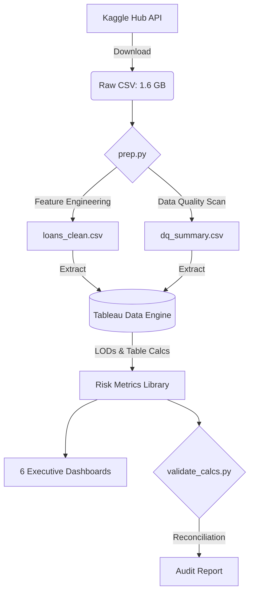

# 🏦 Credit Portfolio Risk & Operations Control Tower

**Executive Summary:** A comprehensive, end-to-end data pipeline and 6-dashboard Tableau application built on ~2.26M LendingClub loans. This project transforms a raw, highly granular loan tape into a governed risk-and-operations cockpit featuring LOD-driven Expected Loss (PD/LGD) models, vintage cohort analysis, pricing adequacy testing, geographic concentration tracking (HHI), and a parameter-driven stress testing engine.

**[👉 View the Interactive Dashboard on Tableau Public](https://public.tableau.com/shared/WQXCR3GD7)**

---

## 📑 Table of Contents
1. [Architecture & Workflow](#1-architecture--workflow)
2. [Business Problem & Objective](#2-business-problem--objective)
3. [ETL Pipeline (Python)](#3-etl-pipeline-python)
4. [Tableau Semantic Model](#4-tableau-semantic-model)
5. [Advanced Tableau Implementation](#5-advanced-tableau-implementation)
6. [Data Validation & Audit](#6-data-validation--audit)
7. [Key Analytical Findings](#7-key-analytical-findings)
8. [Metric Dictionary](#8-metric-dictionary)

---

## 🏗️ 1. Architecture & Workflow

---

## 🎯 2. Business Problem & Objective

**The Challenge:** 
Financial institutions often suffer from siloed reporting. Risk teams look at static vintage loss reports, operations teams look at isolated delinquency pipelines, and pricing teams analyze weighted coupons without forward-looking stress impacts. Furthermore, "Default Rate" is frequently miscalculated due to survivorship bias (including immature loans in the denominator).

**The Solution:**
A unified "Control Tower" providing a single source of truth. 
* **Executive Audience:** High-level KPIs and volume tracking.
* **Risk Audience:** Vintage heatmaps, dynamic Pricing Cushion matrix, and parameter-driven stress testing.
* **Operations Audience:** Delinquency watchlist, exposure tracking, and automated data quality audits.

---

## ⚙️ 3. ETL Pipeline (Python)

The data ingestion and transformation layer is handled by `prep.py`, utilizing `pandas` for memory-efficient processing of the 2.26 million rows.

* **Data Ingestion:** Automated fetching of the `accepted_2007_to_2018Q4.csv` from Kaggle.
* **Dimensionality Reduction:** Dropped highly sparse and redundant columns, isolating 29 strictly necessary features to optimize the Tableau Hyper extract size.
* **Feature Engineering:**
  * Created `fico_midpoint` from high/low bounds.
  * Derived strict temporal features (`issue_date`, `last_pymnt_date`).
* **Data Quality (DQ) Generation:** Programmatically generated `dq_summary.csv` containing null-percentages and outlier counts per field to feed the Tableau Governance dashboard.

---

## 🗄️ 4. Tableau Semantic Model

The Tableau environment was strictly structured to ensure high performance and absolute metric governance.

* **Connection Type:** Extracted `.hyper` file (optimized for large datasets; live connection unnecessary for static historical portfolio).
* **Geographic Mapping:** `addr_state` explicitly assigned Geographic Role for rendering spatial aggregations.
* **Survivorship Bias Control:** Implemented a binary `Mature Flag` (`IF DATEADD('month',[term_months],[issue_date]) <= #2018-12-31# THEN 1 ELSE 0 END`). All lagging risk metrics strictly filter out immature originations to prevent artificial deflation of default rates.

---

## 🚀 5. Advanced Tableau Implementation

This project intentionally demonstrates senior-level Tableau development techniques, avoiding basic aggregate charts in favor of complex, dynamic visualizations.

| Technique | Implementation Details |
|-----------|------------------------|
| **FIXED LOD Expressions** | Calculated `PD by Grade` and `LGD (Portfolio)` overriding view granularity to accurately compute Row-Level Expected Loss. |
| **Table Calculations** | Utilized `RUNNING_SUM` for Pareto distributions, `WINDOW_SUM` for Herfindahl-Hirschman Index (HHI) concentration, and `WINDOW_AVG` for 4-quarter vintage trendlines. |
| **Dynamic Zone Visibility** | Parameter-driven boolean toggles on the Executive Dashboard to seamlessly swap breakdown charts (Grade vs. Purpose vs. State) without sheet-swapping layout containers. |
| **Set Actions** | Implemented interactive cross-dashboard highlighting on the Geography pane (clicking the map adds the state to `Selected State Set`, driving color encoding on the Pareto chart). |
| **Viz-in-Tooltip** | Embedded sparklines within the Vintage Heatmap to reveal temporal default curves on hover. |
| **Dual-Axis Synchronization** | Built Bar-in-Bar charts (using the Size shelf) to compare Weighted Coupon against Annualised Loss Rate on a synchronized axis. |
| **Gantt / Stacked Waterfall** | Visualized the incremental portfolio impact of Stressed PD and LGD parameter modifications. |

---

## 🧪 6. Data Validation & Audit

To prove data integrity, all critical calculations were computed independently in Python (`validate_calcs.py`) and reconciled against the Tableau visual aggregations. **Zero variance was permitted.**

| Metric | Validated Value | Match? |
|--------|-----------------|--------|
| **Total Row Count** | 2,260,668 | ✅ |
| **Total Funded Volume** | $34.0B | ✅ |
| **Default Rate (Mature)** | 14.86% | ✅ |
| **PD Grade A** | 5.50% | ✅ |
| **PD Grade G** | 37.35% | ✅ |
| **LGD (Portfolio)** | 89.18% | ✅ |
| **Expected Loss (Base)** | $1.3B | ✅ |
| **EL Rate** | 13.62% | ✅ |
| **Weighted Coupon** | 13.38% | ✅ |
| **Annualised Loss Rate** | 2.44% | ✅ |
| **Pricing Cushion** | 11.31% | ✅ |
| **HHI (Geographic Concentration)** | 0.0528 | ✅ |

---

## 💡 7. Key Analytical Findings

1. **Systemic Mispricing in Sub-Prime Bands:** All grades show a mathematically positive Pricing Cushion on an *annualised* basis. However, the forward-looking EL Rate (13.62%) calculated via PD × LGD slightly exceeds the weighted portfolio coupon (13.38%). This signals that the live book currently carries more systemic risk than the historical loss rates indicate.
2. **Vintage Deterioration:** 2007Q4 was the worst-performing mature vintage at a 29.56% default rate (pre-crisis originations). Vintages stabilized significantly post-2014, settling into a highly predictable 13–15% range.
3. **FICO / DTI Blindspots:** Cross-tabulating FICO against DTI reveals that `FICO < 660` cohorts are systematically mispriced regardless of DTI, exhibiting default rates of 27–33% against coupons of only 14–17% (yielding negative cushions as deep as -18%).
4. **Geographic Concentration:** California dominates at 14.13% of total funded volume. The Top 5 states (CA, NY, TX, FL, NJ) hold nearly 42% of the book. However, the HHI of 0.0528 indicates the portfolio remains moderately diversified without dangerous hyper-concentration.
5. **Zero Stress Buffer:** The portfolio's break-even PD Multiplier is effectively `1.0x`. Simulating a mere 10% macro increase in defaults (1.1x PD Multiplier) immediately plunges the portfolio into a negative pricing cushion (-1.60%), wiping out all modeled profitability.

---

## 📖 8. Metric Dictionary

<b>Click to expand full technical metric definitions</b>

 

* **Default Flag:** `IF [loan_status] IN ('Charged Off','Default','Does not meet the credit policy. Status:Charged Off') THEN 1 ELSE 0 END`
* **Mature Flag:** `IF DATEADD('month',[term_months],[issue_date]) <= #2018-12-31# THEN 1 ELSE 0 END` (Filters out loans that have not had sufficient time to default).
* **Live Exposure:** Outstanding principal remaining on currently active/late loans.
* **PD by Grade (LOD):** `{ FIXED [grade] : SUM(Mature Defaults) / SUM(Mature Loans) }`
* **LGD (Portfolio, LOD):** `{ FIXED : 1 - (SUM(Recoveries) / SUM(Defaulted Exposure)) }`
* **Row-Level Expected Loss:** `[Live Exposure] * [PD by Grade] * [LGD]`
* **Weighted Coupon:** `SUM([int_rate]*[funded_amnt]) / SUM([funded_amnt]) / 100`
* **Pricing Cushion:** `[Weighted Coupon] - [Annualised Loss Rate]`
* **Stressed EL:** `[Live Exposure] * MIN(1,[PD by Grade]*[PD Multiplier]) * MIN(1,[LGD]+[LGD Add-on])`
* **HHI (Table Calc):** `WINDOW_SUM(([State Share])^2)`

---

## ⚠️ Limitations & Future Work
* Dataset truncated at Q4 2018; lacks post-COVID macroeconomic stress data.
* LGD is calculated at the portfolio level rather than the segment level due to granular recovery data constraints.
* Future iterations will incorporate macroeconomic regressors (unemployment rates, GDP growth) for more robust stress testing.

---

## 🔧 How to Reproduce
1. Clone the repository.
2. Install dependencies: `pip install -r requirements.txt`
3. Execute the ETL pipeline: `python prep/prep.py` *(Downloads ~1.6GB from Kaggle)*
4. Execute the validation suite: `python prep/validate_calcs.py`
5. Connect Tableau to the generated `data/loans_clean.csv` and follow the technical documentation in `/docs`.
